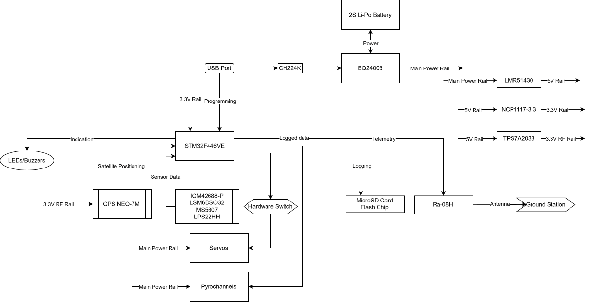

# Polaris
Open source flight computer
##  High-Level Flight Computer Architecture

## 1. Power:
The whole system is powered by a single 2S Li-Po battery that can be charged via USB-C PD.
- Main Power Rail: 7.4-8.4V from battery or 9V from USB-C PD
- Battery charger IC: Texas Instruments BQ24005
- 5V regulator (switching): Texas Instruments LMR51430
- 3.3V regulator (linear): Texas Instruments TLV75733
- 3.3V RF regulator (linear): Texas Instruments TPS7A2033
- USB-PD negotiation: WCH CH224K

Please note that the 9V from USB-C PD *cannot* power servos or pyrochannels. 9V USB-PD is capped to 3A of current, while the control electronics can easily consume 800 mA by itself.
## 2. Processing:
The board is powered by an STM32F446VE from ST Microelectronics (NAV).
This is a 180 MHz MCU based on the ARM Cortex-M4 with FPU.\
It is, honestly, a lot more powerful than needed, but it was chosen because it is easier to develop for with the Nucleo-F446RE being widely available. The larger LQFP100 version was chosen due to larger number of GPIO pins exposed.
## 3. Sensors:
All connected to NAV only
- IMUs:
	- Main IMU: TDK InvenSense ICM42688-P
	- High-G Accelerometer: ST Microelectronics LSM6DSO32
- Barometric Pressure Sensors:
	- TE Connectivity MS5607-02BA03
	- ST Microelectronics LPS22HHTR
- GNSS Module: u-blox GPS NEO-7M

I used the LSM6DSO32 since dedicated high-G accelerometers were either unavailable or too expensive.\
I used two barometers for redundancy.\
I wanted to use the newer GPS NEO-M8N instead of the NEO-7M since it has reached EoL. Unfortunately it is out of stock wherever I search, or is four times any reasonable price.
## 4. Communication and Logging:
All sensor and calculated data is communicated through/logged to:
- Telemetry: Ai-Thinker Ra-08H
- Logging:
	- MicroSD Card slot
	- Winbond W25Q128JVE 16 MB flash

The Ra-08H is a fairly cheap LoRa module based on the ASR6601 SoC, working at anywhere between 803-930 MHz.\
I chose a flash chip to log to since it is actually soldered to the board and can survive much higher vibration environments.\
I still opted to add a microSD slot for the flexibility.
## 5. Active Control:
Active control is achieved through 6 servo lines controlled via PWM signals from NAV.\
The board supports both thrust vector control and fin control. These lines can be split up in any which way.\
The servos must be high-power and operate at up to 9V, since their power rail will be connected directly to the (up to) 8.4V of the battery.\
I have planned feature of choosing between high-voltage (8.4V max) and 5V to power the servo, through maybe a solder pad or screw terminal.\
Power supplied to the active control servos is controlled through an XT-60 terminal. When active control is needed, plug this terminal with a short-circuit cap, making sure that the cap can withstand the current drawn by the servos. In case the active control system is not in the best condition to operate at launch, this provides an easy way to cut off the system so that the rocket can still launch.
## 6. Others:
The board supports firing up to 6 pyrochannels, each of which can sit at 5A continuous current.\
The board has continuity sensing on all pyrochannels.\
The board can be charged and programmed via a single USB-C receptacle. For programming, hold down the boot push-button and power cycle the microcontroller using the reset push-button. Then connect the board to a computer using an ordinary USB-C cable.\
The board also exposes SWD pins from the microcontroller. It can be programmed or probed from this header.\
Status is indicated by 6 LEDs and a buzzer. Two of those LEDs are connected to the battery charger IC, to indicate charge state.
